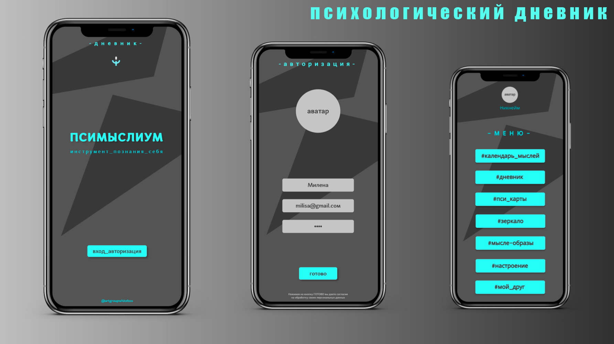
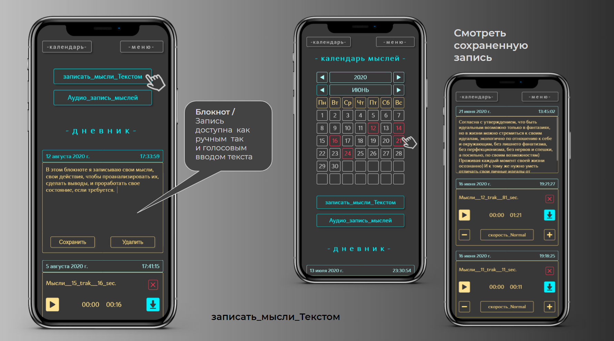
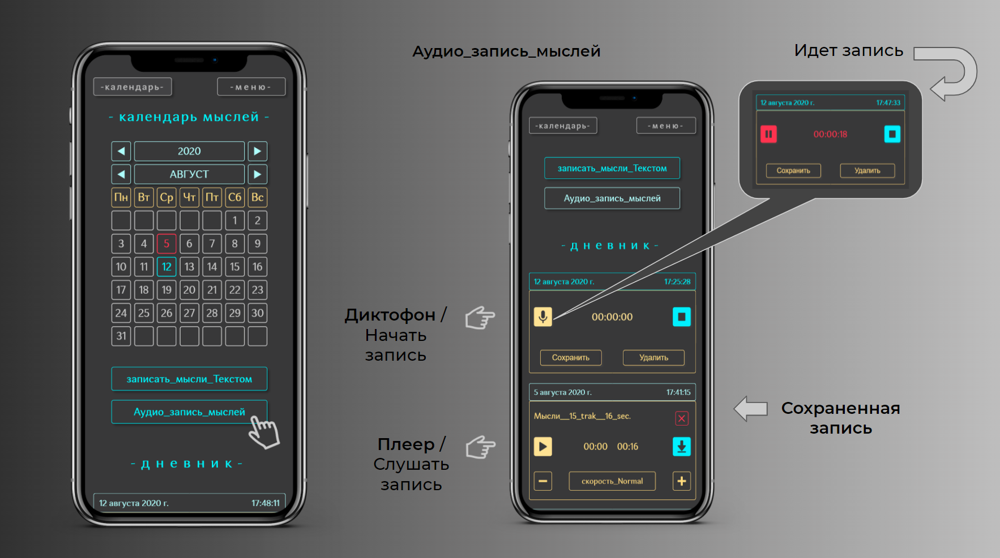
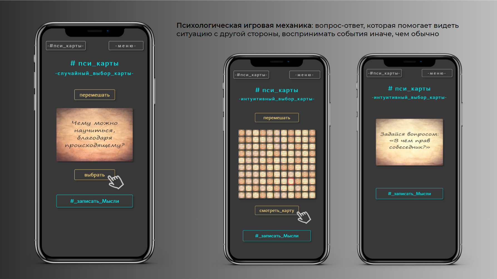
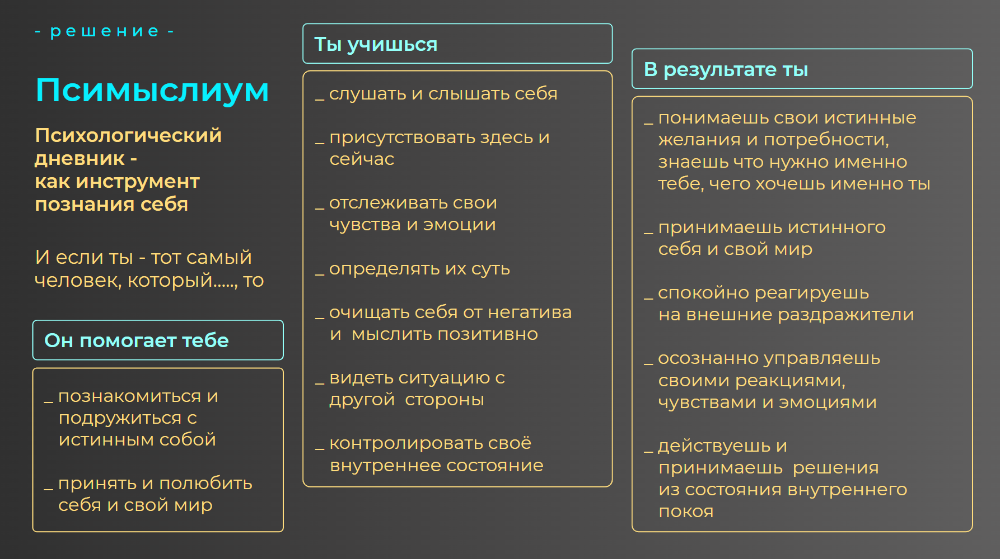
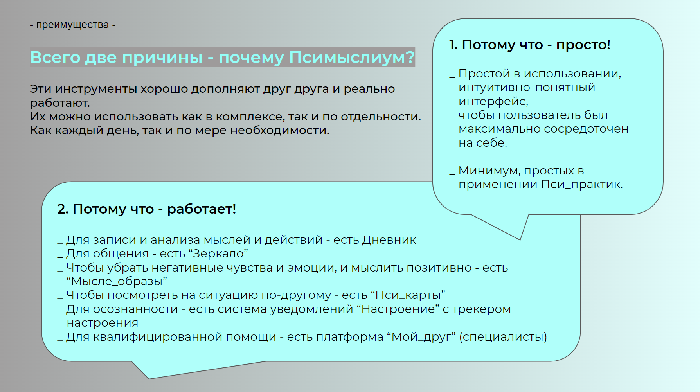

# psymyslium_psychological_diary

Публичный адрес сайта: [https://artgroupwhitebox.github.io/psymyslium_psychological_diary/](https://artgroupwhitebox.github.io/psymyslium_psychological_diary/)

## Технологии

- Дизайн прототипа разработан в Figma 
- Код написан на нативном JS, CSS, HTML
- С использаванием Local Storage 
- Дизайн сайта адаптивный, с применением Grid и Flex

Это мое первое веб приложение, первый в жизни код

## Функционал приложения, реализованный на данный момент

#### Дневник с диктофоном и блокнотом и Календарь_мыслей, в котором красным цветом подсвечены даты с записями, для быстрого доступа к ним:

#### Диктофон для записи мыслей в Дневник и плеер для прослушивания:

#### Слайдер для рандомного выбора карты:

## Идея приложения

## Для начала работы в приложении 
Нужно открыть в браузере файл index1.html из папки psymyslium 

- index1.html

## Для авторизации необходимо заполнить обязательные поля

- имя_аватар
- логин_эл_почта
- пароль

Данные можно вводить не актуальные, но по правилам поля

